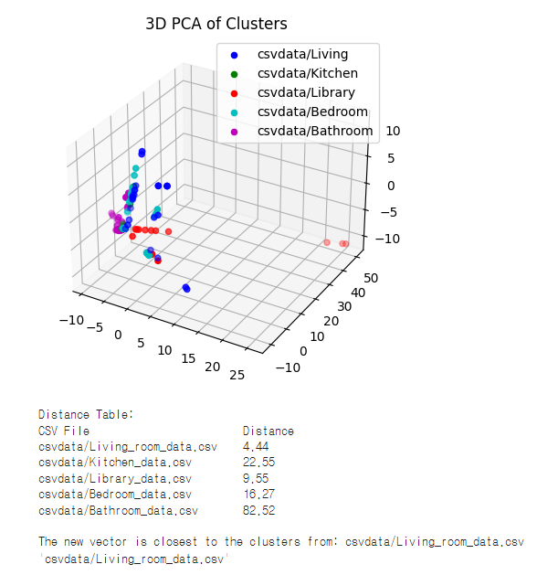

# YOLOv5-Indoor-Space-Type-Classification

## 개요 | Outline

이 프로그램은 [YOLOv5](https://docs.ultralytics.com/yolov5)🚀를 이용한 프로그램입니다. 실내 방 사진을 첨부하면 프로그램은 이를 분석해 방 종류를 판별합니다. 판별할 수 있는 방 종류는 5개로, 각각 거실, 주방, 침실, 서재 ,화장실입니다. 
This program uses [YOLOv5](https://docs.ultralytics.com/yolov5)🚀. When you attach a picture of a room inside, the program analyzes it and determines the type of room. There are five types of rooms that can be distinguished: a living room, a kitchen, a bedroom, a study, and a bathroom.

## 사용법 | How to use

매우 간단합니다! 
It's very simple!
1. "YOLOv5-Indoor-Space-Type-Classification.ipynb"를 실행하세요. | Open the "YOLOv5-Indoor-Space-Type-Classification.ipynb" first.
2. 내용을 확인하고 안내된 과정에 따라 실행 버튼을 누르세요. | Check the contents and press the Run button according to the guided process.
3. 결과를 확인하세요! | Check the results!

## 기타자료 | Other data

Heatmap

분석에 사용된 자료를 볼 수 있습니다. heatmap 문서를 확인하세요.

